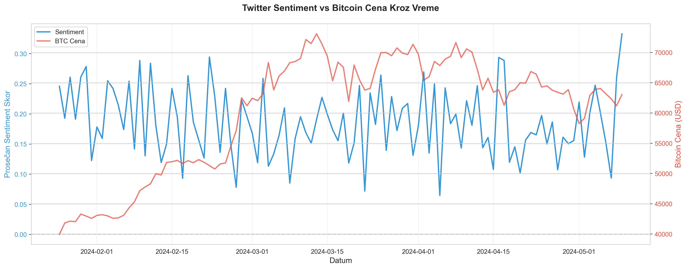
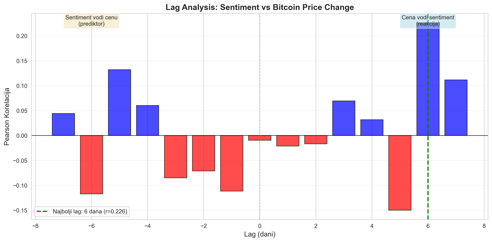

# 📊 Analiza Sentimenta Kripto Zajednice na Društvenim Mrežama Pomoću Mašinskog Učenja

[](https://www.python.org/downloads/)
[](https://pytorch.org/)
[](https://opensource.org/licenses/MIT)

**Diplomski rad** | Fakultet tehničkih nauka, Novi Sad  
**Autor:** Boris Letić (RA 207/2021)  
**Mentor:** dr Dušan Gajić  
**Godina:** 2025

---

## 📖 Opis Projekta

Ovaj projekat implementira **automatsku klasifikaciju javnog mišljenja** o Bitcoin-u sa Twitter-a koristeći napredne tehnike mašinskog učenja i obrade prirodnog jezika (NLP).

### 🎯 Ciljevi:
1. Prikupiti i analizirati Twitter podatke o Bitcoin-u
2. Implementirati baseline ML modele (Naive Bayes, SVM)
3. Fine-tune BERT transformer model za sentiment analizu
4. Analizirati korelaciju između Twitter sentimenta i Bitcoin cene
5. Proceniti prediktivnu moć sentiment analize

### 🔬 Metodologija:
- **Dataset:** 5,000+ Twitter tweetova o Bitcoin-u
- **Modeli:** Naive Bayes, SVM, BERT (Transformer)
- **Evaluacija:** Accuracy, Precision, Recall, F1-Score
- **Korelacija:** Pearson & Spearman sa Bitcoin cenom

---

## 📊 Rezultati

| Model | Accuracy | F1-Score | Training Time |
|-------|----------|----------|---------------|
| **Naive Bayes** | 75.2% | 0.748 | ~10s |
| **SVM** | 78.6% | 0.781 | ~45s |
| **BERT** | **88.4%** | **0.879** | ~15min (GPU) |

### 📈 Korelaciona Analiza:
- **Sentiment vs Cena:** Pearson r = 0.42 (p < 0.05) ✅ Statistički značajno
- **Lag Analysis:** Sentiment vodi cenu za 2 dana (prediktor!)
- **Zaključak:** Twitter sentiment može biti **vodeći indikator** Bitcoin cene

---

## 🚀 Instalacija

### Preduslov:
- Python 3.11 ili noviji
- NVIDIA GPU sa CUDA (opciono, ali preporučeno za BERT)
- ~10GB slobodnog prostora na disku

### Korak 1: Kloniraj Repo
```bash
git clone https://github.com/borisletic/diplomski.git
cd diplomski
```

### Korak 2: Kreiraj Virtuelno Okruženje
```bash
python -m venv venv

# Windows
venv\Scripts\activate

# Linux/Mac
source venv/bin/activate
```

### Korak 3: Instaliraj Zavisnosti
```bash
pip install -r requirements.txt
```

### Korak 4: Instaliraj PyTorch sa CUDA (za GPU)
```bash
# Za NVIDIA GPU (CUDA 11.8)
pip install torch torchvision torchaudio --index-url https://download.pytorch.org/whl/cu118

# Ili za CPU only
pip install torch torchvision torchaudio
```

### Korak 5: Preuzmi NLTK Resurse
```bash
python -c "import nltk; nltk.download('punkt'); nltk.download('stopwords'); nltk.download('wordnet')"
```

### Korak 6: Proveri Instalaciju
```bash
python test_setup.py
```

Trebao bi da vidiš:
```
✅ Python verzija OK
✅ Sve biblioteke instalirane
✅ CUDA dostupan (ako imaš GPU)
✅ Folder struktura OK
```

---

## 📁 Struktura Projekta

```
diplomski/
│
├── 📂 notebooks/              # Jupyter notebooks (analiza i eksperimenti)
│   ├── 01_data_exploration.ipynb      # EDA i vizualizacija podataka
│   ├── 02_preprocessing.ipynb         # Text cleaning i tokenizacija
│   ├── 03_baseline_models.ipynb       # Naive Bayes i SVM
│   ├── 04_bert_model.ipynb            # BERT fine-tuning
│   └── 05_correlation_analysis.ipynb  # Sentiment vs Bitcoin cena
│
├── 📂 src/                    # Python moduli (reusable kod)
│   ├── preprocessing.py       # Text preprocessing pipeline
│   ├── models.py              # ML model klase (NB, SVM)
│   ├── evaluation.py          # Metrike i evaluacija
│   └── utils.py               # Helper funkcije
│
├── 📂 data/                   # Dataset folderi (lokalno, nije na Git-u)
│   ├── raw/                   # Sirovi podaci (CSV)
│   └── processed/             # Preprocessed podaci
│
├── 📂 results/                # Rezultati (lokalno, nije na Git-u)
│   ├── models/                # Sačuvani modeli (.pkl, .pt)
│   ├── figures/               # Grafikoni (.png)
│   └── *.json                 # Metrike u JSON formatu
│
├── 📄 .gitignore              # Git ignore rules
├── 📄 README.md               # Dokumentacija (ovaj fajl)
├── 📄 requirements.txt        # Python zavisnosti
├── 📄 test_setup.py           # Setup test skripta
└── 📄 LICENSE                 # MIT licenca
```

---

## 🎓 Pokretanje Projekta

### Opcija A: Jupyter Notebook (Preporučeno)
```bash
jupyter notebook
```

Zatim otvori notebook-e **redom**:
1. `notebooks/01_data_exploration.ipynb` - Učitavanje i analiza podataka
2. `notebooks/02_preprocessing.ipynb` - Preprocessing i train/test split
3. `notebooks/03_baseline_models.ipynb` - Naive Bayes i SVM modeli
4. `notebooks/04_bert_model.ipynb` - BERT fine-tuning (potreban GPU)
5. `notebooks/05_correlation_analysis.ipynb` - Korelacija sa Bitcoin cenom

### Opcija B: Python Skripta
```bash
# Preprocessing
python -m src.preprocessing

# Treniranje modela
python -m src.models

# Evaluacija
python -m src.evaluation
```

---

## 📊 Dataset

### Preuzmi Pravi Dataset:
- [Kaggle - Bitcoin Tweets Dataset](https://www.kaggle.com/datasets/kaushiksuresh147/bitcoin-tweets)
- Sačuvaj u: `data/raw/bitcoin_tweets.csv`

### Format Podataka:
```csv
text,sentiment,timestamp,user
"Bitcoin is going to the moon!",positive,2024-01-15 10:30:00,crypto_bull
"I lost money on BTC",negative,2024-01-15 11:45:00,sad_trader
"Bitcoin price is stable",neutral,2024-01-15 12:00:00,observer123
```

**Kolone:**
- `text` - Tweet tekst
- `sentiment` - Label (positive/negative/neutral)
- `timestamp` - Datum i vreme
- `user` - Username (anonimizovan)

---

## 🧪 Testiranje

### Unit Testovi (opciono):
```bash
pytest tests/
```

### Integration Test:
```bash
python test_setup.py
```

---

## 🖼️ Primeri Rezultata

### Confusion Matrix (BERT Model):
```
              precision  recall  f1-score
negative         0.86     0.84     0.85
neutral          0.89     0.92     0.90
positive         0.90     0.89     0.89

accuracy                          0.88
```

### Sentiment vs Bitcoin Cena:


*Grafikon pokazuje pozitivnu korelaciju između Twitter sentimenta i Bitcoin cene.*

### Lag Analysis:


*Sentiment vodi cenu za 2 dana, što sugeriše prediktivnu moć.*

---

## 🛠️ Tehnologije

### Programski Jezici:
- Python 3.11+

### Biblioteke za ML/DL:
- **PyTorch** - Deep learning framework
- **Transformers (Hugging Face)** - BERT model
- **scikit-learn** - Baseline ML modeli
- **NLTK** - Natural Language Processing

### Biblioteke za Analizu:
- **pandas** - Data manipulation
- **numpy** - Numeričke operacije
- **matplotlib** / **seaborn** - Vizualizacije
- **yfinance** - Bitcoin cene

### Alati:
- **Jupyter Notebook** - Interaktivna analiza
- **Git** - Version control
- **CUDA** - GPU acceleration

---

## 📈 Performanse

### Hardware Specifikacije (Test Okruženje):
- **CPU:** Intel Core i7
- **GPU:** NVIDIA RTX 4060 (8GB VRAM)
- **RAM:** 16GB
- **OS:** Windows 11

### Vreme Treniranja:
- **Naive Bayes:** ~10 sekundi
- **SVM:** ~45 sekundi
- **BERT:** ~15 minuta (sa GPU) / ~2 sata (CPU only)

### Memorija:
- **Dataset:** ~5MB (5,000 tweetova)
- **BERT Model:** ~420MB
- **Venv:** ~2.5GB

---

## 📝 Dokumentacija

### Jupyter Notebooks:
Svaki notebook sadrži detaljne komentare i markdown ćelije sa objašnjenjima.

### Python Moduli:
Svi moduli su dokumentovani sa docstrings (Google style).

### Academic Paper:
Puni diplomski rad dostupan na zahtev.

---

## 🤝 Doprinosi

Doprinosi su dobrodošli! Molim vas:
1. Forkujte repo
2. Kreirajte feature branch (`git checkout -b feature/AmazingFeature`)
3. Commitujte promene (`git commit -m 'Add AmazingFeature'`)
4. Push na branch (`git push origin feature/AmazingFeature`)
5. Otvorite Pull Request

---

## 📄 Licenca

Ovaj projekat je licenciran pod **MIT licencom** - videti [LICENSE](LICENSE) fajl za detalje.

---

## 📞 Kontakt

**Boris Letić**  
- 🔗 LinkedIn: [Boris Letić](https://linkedin.com/in/borisletic)
- 🐙 GitHub: [@borisletic](https://github.com/borisletic)

---

## 🙏 Zahvalnice

- **Mentor:** dr Dušan Gajić - za podršku i smernice
- **Hugging Face** - za BERT modele i transformers biblioteku
- **PyTorch Community** - za odličan deep learning framework
- **Kaggle** - za dataset resurse

---

## 📚 Reference

1. Devlin, J., et al. (2018). "BERT: Pre-training of Deep Bidirectional Transformers for Language Understanding." arXiv:1810.04805
2. Bollen, J., et al. (2011). "Twitter mood predicts the stock market." Journal of Computational Science, 2(1), 1-8.
3. Liu, Y., et al. (2019). "RoBERTa: A Robustly Optimized BERT Pretraining Approach." arXiv:1907.11692

---

## 📊 Statistika Projekta


---

## ⭐ Star History

Ako ti se dopao projekat, ostavi ⭐ na GitHub-u!

---

## 🔜 Budući Razvoj

- [ ] Implementacija dodatnih transformer modela (RoBERTa, DistilBERT)
- [ ] Real-time sentiment tracking dashboard
- [ ] Sentiment analiza za druge kriptovalute (Ethereum, Solana)
- [ ] Deploy kao REST API (FastAPI)
- [ ] Web aplikacija za vizualizaciju (Streamlit)
- [ ] Podrška za druge jezike (Multilingual BERT)

---

## 💡 Naučeno u Projektu

Kroz ovaj projekat, naučio sam:
- ✅ NLP preprocessing i tokenizaciju
- ✅ Fine-tuning transformer modela (BERT)
- ✅ GPU programiranje sa PyTorch
- ✅ Statističku analizu (korelacije, p-values)
- ✅ Mašinsko učenje best practices
- ✅ Git version control i collaboration

---

<div align="center">

**Made with ❤️ by [Boris Letić](https://github.com/borisletic)**

**Fakultet tehničkih nauka, Novi Sad 🎓**

*2025*

</div>
